

<table>
    <theader>
        <tr>
            <td></td>
            <th>
                UNIVERSIDAD NACIONAL DE SAN AGUSTIN 
                FACULTAD DE INGENIERÍA DE PRODUCCIÓN Y SERVICIOS 
                DEPARTAMENTO ACADÉMICO DE INGENIERÍA DE SISTEMAS E INFORMÁTICA 
                ESCUELA PROFESIONAL DE INGENIERÍA DE SISTEMAS
            </th>
            <td></td>
        </tr>
    </theader>
    <tbody>
        <tr><td colspan="3">Formato: Informe de Práctica de Laboratorio</td></tr>
        <tr><td>Aprobación:  2022/03/01</td><td>Código: GUIA-PRLD-001</td><td>Página: 1</td></tr>
    </tbody>
</table>

INFORME DE LABORATORIO 

<table>
<theader>
<tr><th colspan="6">INFORMACIÓN BÁSICA</th></tr>
</theader>
<tbody>
<tr><td>ASIGNATURA:</td><td colspan="5">Programación Web 2</td></tr>
<tr><td>TÍTULO DE LA PRÁCTICA:</td><td colspan="5">Django - Usando una plantilla para ver Destinos Turísticos</td></tr>
<tr>
<td>NÚMERO DE PRÁCTICA:</td><td>06</td><td>AÑO LECTIVO:</td><td>2023 A</td><td>NRO. SEMESTRE:</td><td>III</td>
</tr>
<tr>
<td>FECHA INICIO::</td><td>20-Jun-2023</td><td>FECHA FIN:</td><td>03-Jul-2023</td><td>DURACIÓN:</td><td>08 horas</td>
</tr>
<tr><td colspan="6">DOCENTE:
<ul>
<li>Anibal Sardon </li>
</ul>
</td>
</<tr>
<tr><td colspan="6">INTEGRANTES:
<ul>
<li>Joshep Antony Ccahuana Larota - jccahuanala@unsa.edu.pe </li>
</ul>
<ul>
<li>Pedro Luis Christian Zapana Romero - pzapanar@unsa.edu.pe </li>
</ul>
</td>
</<tr>
</tdbody>
</table>

# Django - Usando una plantilla para ver Destinos Turísticos

#

## OBJETIVOS

- Implementar una aplicación en Django utilizando una plantilla profesional.
- Utilizar una tabla de Destinos turísticos para leer y completar la página web.
- Utilizar los tags “if” y “for” en los archivos html para leer todos los registros de una tabla desde una base de datos.
#

## TEMAS A TRATAR
- Proyectos de Django
- Aplicaciones en Django
- Plantillas profesionales
- Tags para vistas dinámicas
#

## MARCO TEORICO
- [Documentación de Django](https://docs.djangoproject.com/es/3.2/)
- Un framework es una abstracción en la cual se puede reusar código y funcionalidades adaptándolos a nuestras necesidades.
- Un modelo en un framework se suele referir a los datos y su organización
- Una vista permite apreciar el resultado de la lectura de una tabla incluida en una página web.
#

## ACTIVIDADES
- Crear un proyecto en Django
- Siga los pasos del video para poder implementar la aplicación de Destinos turísticos
- Use git y haga los commits necesarios para manejar correctamente la aplicación.
#

## EJERCICIOS PROPUESTOS
- Deberán replicar la actividad del video donde se obtiene una plantilla de una aplicación de Destinos turísticos y adecuarla a un proyecto en blanco Django.
- Luego trabajar con un modelo de tabla DestinosTuristicos donde se guarden nombreCiudad, descripcionCiudad, imagenCiudad, precioTour, ofertaTour (booleano). Estos destinos turísticos deberán ser agregados en una vista dinámica utilizando tags for e if.
- Para ello crear una carpeta dentro del proyecto github colaborativo con el docente, e informar el link donde se encuentra.
- Crear formularios de Añadir Destinos Turísticos, Modificar, Listar y Eliminar Destinos.
- Eres libre de agregar CSS para decorar tu trabajo.
- Ya sabes que el trabajo con Git es obligatorio. Revisa el avance de la teoría Django parte4
- Pagina Principal (index.html - views.py - urls.py)
  
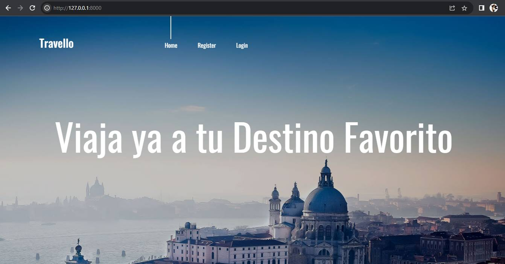

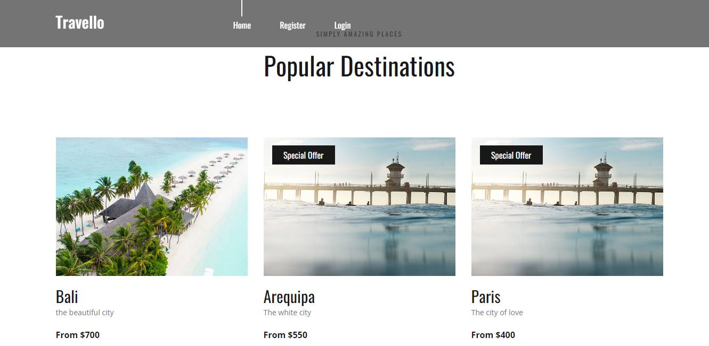

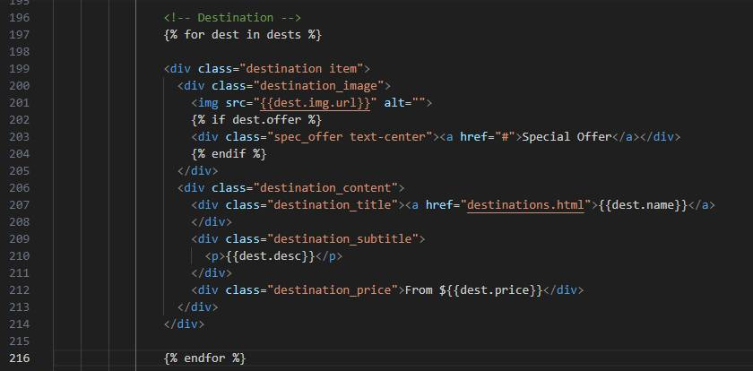

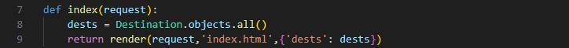

    Se crea un objeto dests en donde se guardan todos los destinos de la base de datos y luego el render se encarga de 
    mostrar la página index.html, además se envía como contexto dests para por medio del tag for se mostrará todos los 
    destinos en la página principal y con el tag if se mostrará si está en oferta.

    Se llama al metodo index qué se encuentra en views.py 

- Login (login.html - views.py - urls.py)
  
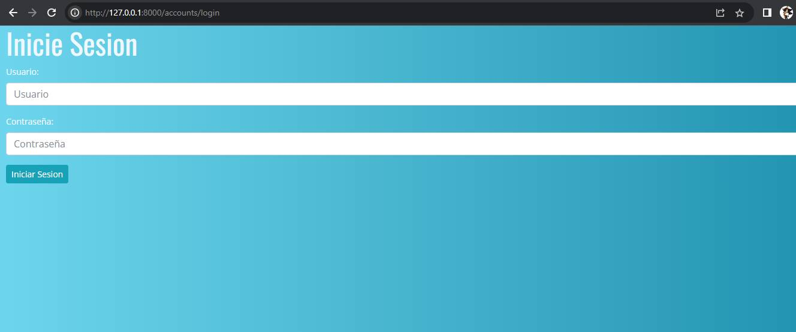
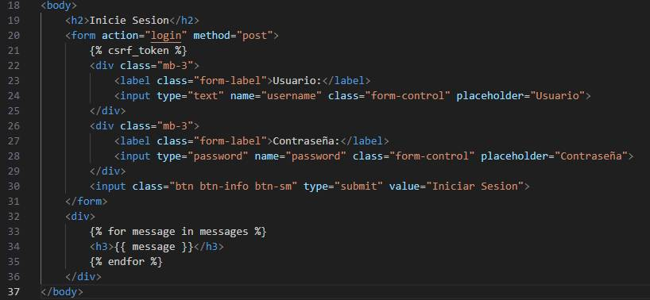
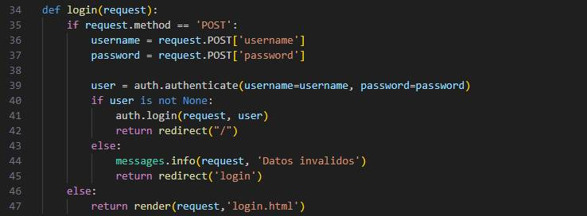

    En la primera llamada al no recibir una solicitud POST se muestra la página register.html donde luego de rellenar los 
    campos y realizar la solicitud son capturados los valores qué se enviaron se autentifica la existencia del usuario de 
    no encontrar coincidencia se envia un mensaje qué los datos son inválidos en caso contrario se redirige al inicio.

    Se llama al metodo login que se encuentra en views.py 

- Superusuario: Puede agregar, modificar y eliminar destinos turísticos.
   
    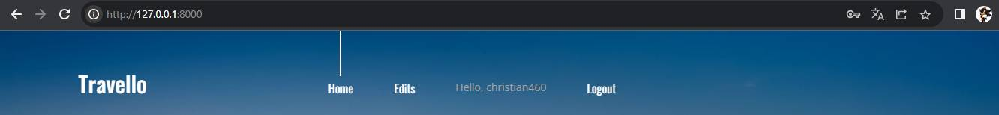
   
- Usuario: Solo se permite qué visualice los destinos disponibles
   
    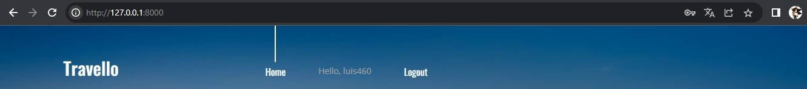

- Registro(register.html - views.py - urls.py)
  
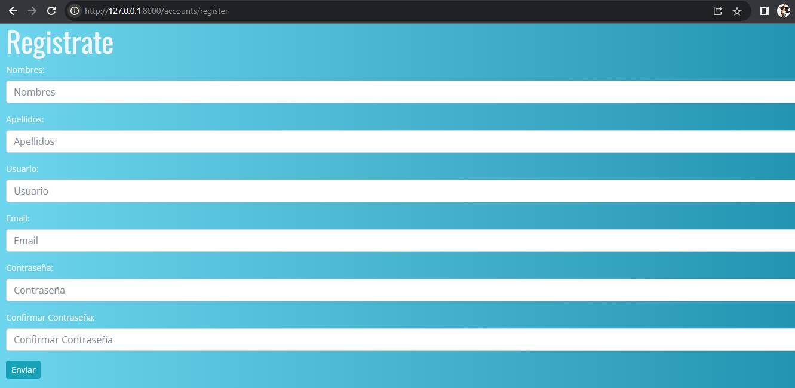

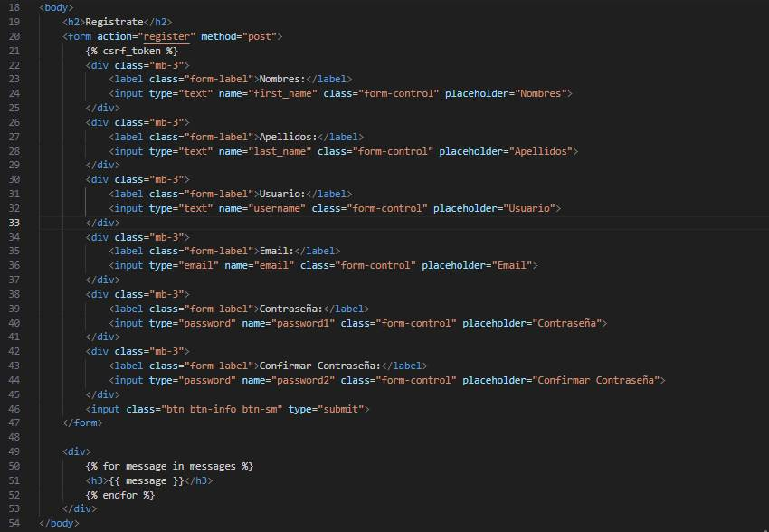

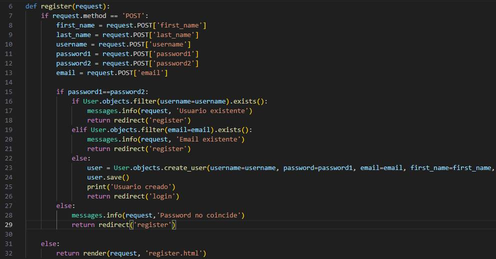

    En la primera llamada al no recibir una solicitud POST se muestra la página register.html donde luego de rellenar los 
    campos y realizar la solicitud son capturados los valores qué se enviaron en el formulario en distintas variables para 
    luego realizar validaciones qué las contraseñas ingresadas coinciden, el usuario y correo q no se repiten. Luego se crea 
    el objeto user donde son asignadas sus atributos y es guardado para luego imprimir en la consola la confirmación  de que 
    se creo correctamente y ser dirigido a login para qué se inicie sesión.  

    Se llama al metodo register que se encuentra en views.py 
    
- Logout (views.py - urls.py)
  
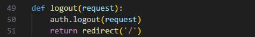

    Mediante  el método auth.logout(request) se cierra la sesión qué esté activa para luego ser redireccionado al inicio.

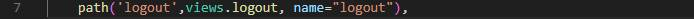

    Se llama al metodo logout que se encuentra en views.py.
    
- Agregar Destinos (add.html - views.py - urls.py)
  
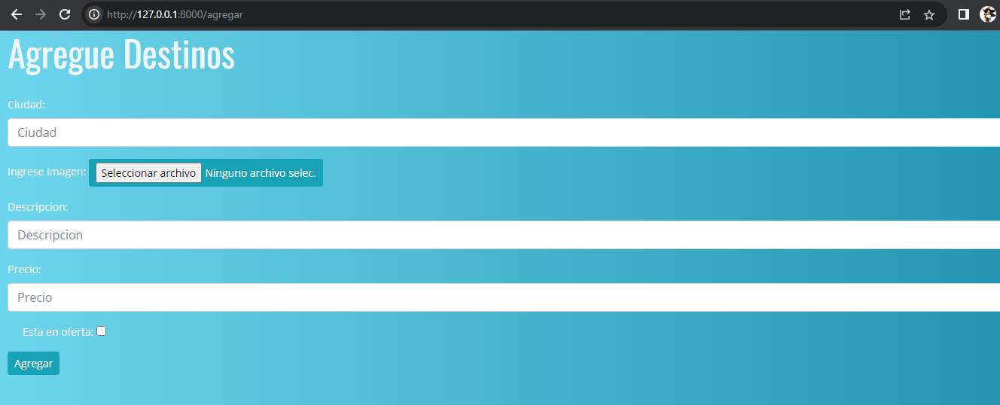

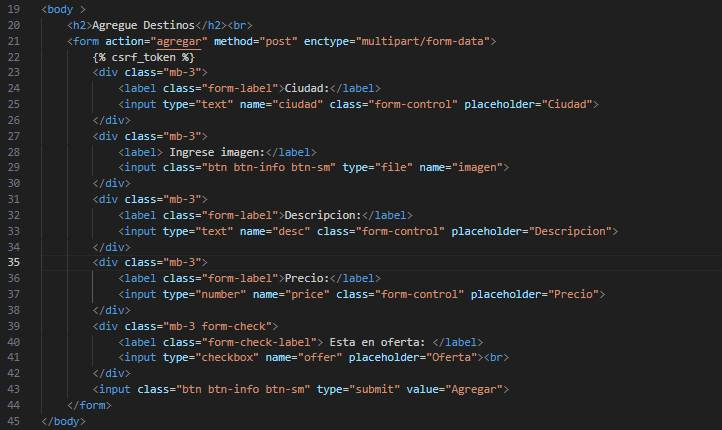

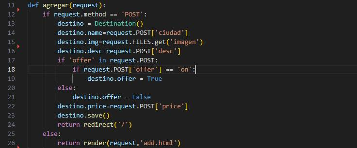

    En la primera llamada al no recibir una solicitud POST se muestra la página add.html donde luego de rellenar los campos
    y realizar la solicitud se crea un objeto destino y se le asignan los valores recogidos del formulario para luego ser 
    guardado con el método save() y ser redireccionado a la página principal.

    Se llama al metodo agregar qué se encuentra en views.py 

- Listar Destinos (list.html - views.py - urls.py)
  
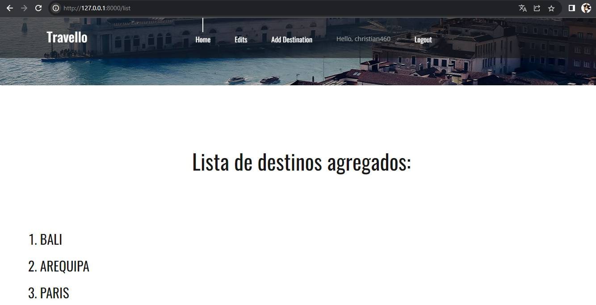

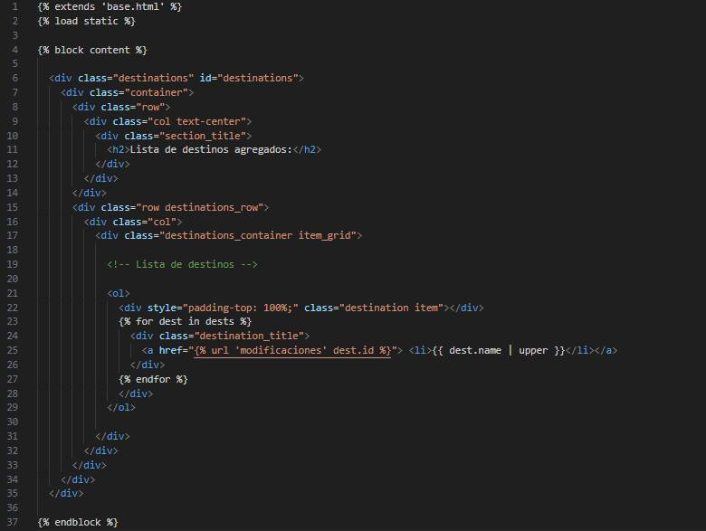

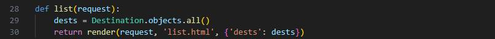

    Se guarda en el objeto dests todos los destinos de la base de datos y con el reder() se muestra la página list.html y como
    contexto se envía dests para poder ser mostrados en la página por medio de un for.

    Se llama al metodo list qué se encuentra en views.py 

- Modificar Destinos (modificacion.html - views.py - urls.py)

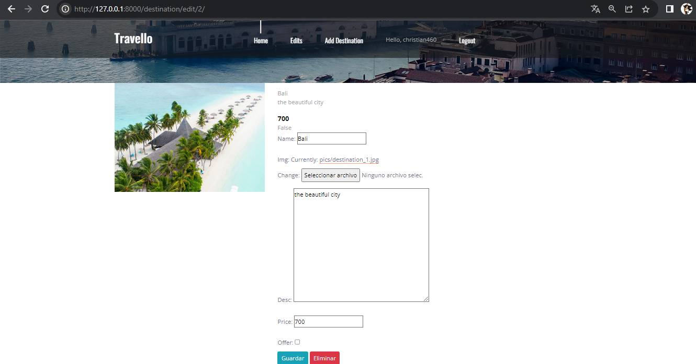

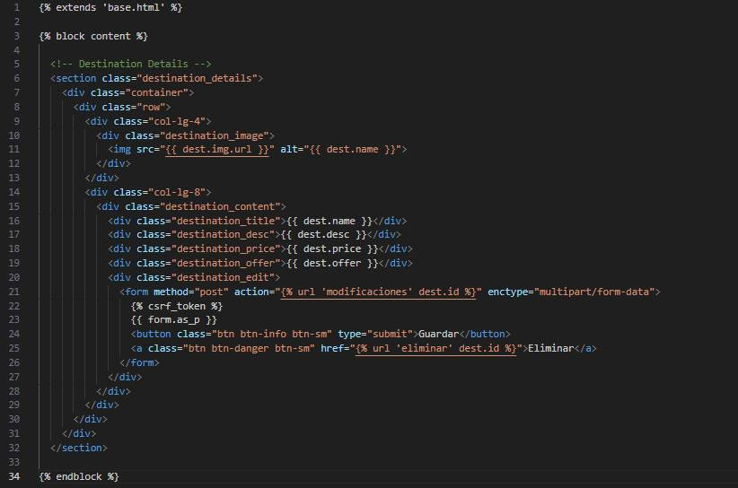

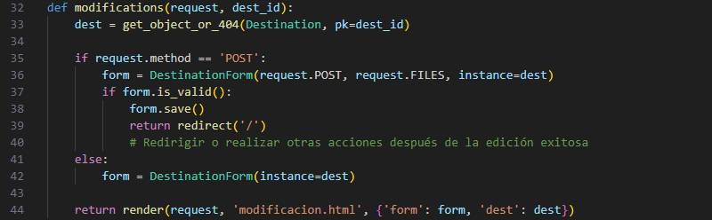

    Por medio de get_object_or_404 podemos obtener el destino con el id que se quiere modificar al recibir la llamada POST se 
    validan los  datos que se ingresaron en el formulario para luego ser guardados y redirigir al usuario a la página de inicio.

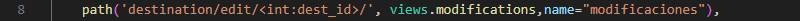

    En la url se envía el id del destino qué se desea modificar y se llama al método modifications que se encuentra en views.py.
    
- Eliminar Destinos (views.py - urls.py)

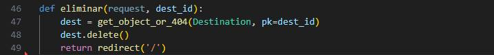

    Por medio de get_object_or_404 podemos obtener el destino con el id que se desea eliminar y se guarda en el objeto dest para
    luego ser eliminado con el método delete() y redirigir a la pagina de inicio.

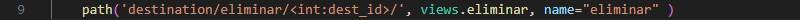

    En la url se envía el id del destino qué se desea eliminar y se llama al método eliminar que se encuentra en views.py  

#

## REFERENCIAS
- Link del repositorio remoto: https://github.com/christian460/Lab_Grupal/tree/master/lab6
- https://www.youtube.com/watch?v=OTmQOjsl0eg&t=5248s

#
